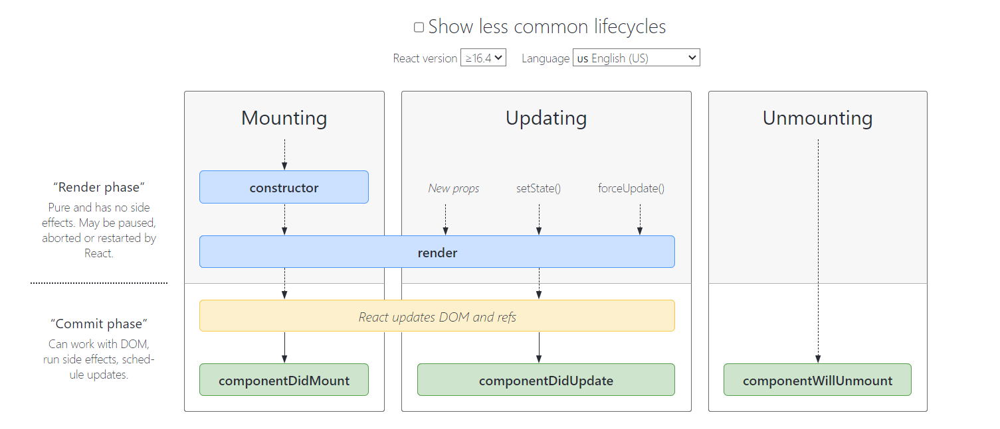
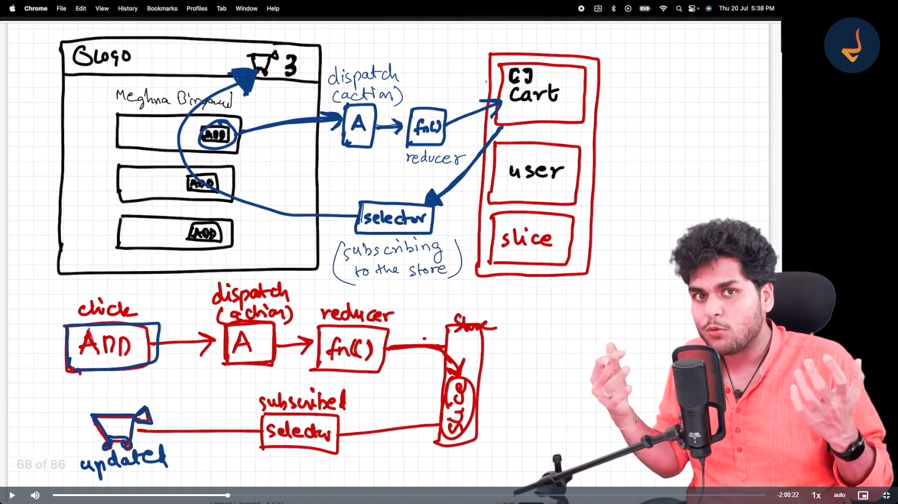

# Namaste React 

# Parcel
    - Dev Build
    - Local server creation
    - HMR => hot module replacement (HOT RELODING)
    - file watching algo.=> written in c++ langauge.
    - Caching- faster build 
    - Image optimisation 
    - as it is a buldler so bundling
    - compressing (removing white space inside code)
    - Minification
    - consistent hashing
    - code splitting 
    - differntial bundling => as our app is going to run on various devices and versions so it will support in that case
    - Diagonostic => gives beautiful error message in console
    - error handling
    - HTTPs
    - Tree shaking algo => remove uncessary code (leaves of trees)( e.g. if we are using 4-5 functions so parcel will remove other not useful functions)
    - Diffrent build for dev and production

Two types of import / export
1=DEFAULT
  - export default componet name;
  - import comp name from 'path';

2=NAMED
  - export const comp name;
  - import {comp name} from 'path';

//REACT LIFECYCLE DIAGRAM LINK AND IMAGE
https://projects.wojtekmaj.pl/react-lifecycle-methods-diagram/
  

# Building store
  - Install @redux.js/toolkit [npm install @reduxjs/toolkit] and react-redux [npm install react-redux].
  - Build Store and connect to app.
  - create SLice (Cart Slice)
  - dispatch action
  - read data using selector
//Redux Store
  

# Testing types by developer
  - unit testing
  - integration testing
  - end to end (e2e testing)